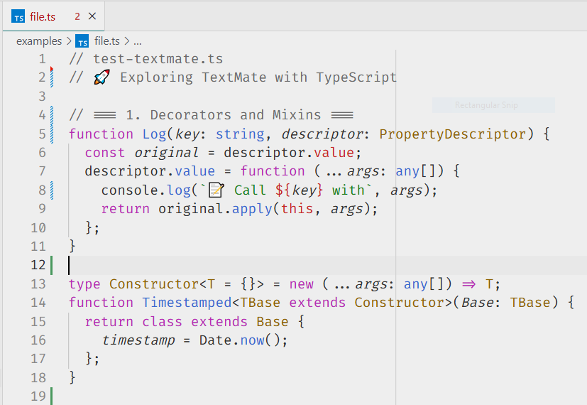

# Albedo 0.93

> **Pre-release** — subject to refinements.

A carefully tuned light theme based on Atom One Light. **Albedo 0.93** explores the lower limit of background brightness while preserving clarity, contrast, and color accuracy. The name refers to the approximate reflectance of its background color (`#eeeeee`), chosen as a compromise between readability and visual comfort during long coding sessions. WCAG-compliant and thoughtfully restrained.

  
*Example using Fira Code*

---

## 🔧 Installation

1. Open the Extensions tab in Visual Studio Code.
2. Search for `Albedo 0.93`.
3. Click **Install**.
4. Open the Command Palette (`Ctrl+Shift+P` or `Cmd+Shift+P`) and select:  
   `Preferences: Color Theme → Albedo 0.93`.

---

## 📁 Repository

Find the source code here:  
👉 [github.com/zherar7ordoya/Albedo-0.93](https://github.com/zherar7ordoya/Albedo-0.93.git)

---

## 🧠 Author

Made with 💙 by **Gerardo Tordoya**  
*Analista Programador*  
📬 [Contact on Telegram](https://t.me/GerardoTordoya)

---

## 📜 License

**MIT** © 2025 Gerardo Tordoya

---

## 📌 Notice

See [CHANGELOG.md](./CHANGELOG.md) for version history.
