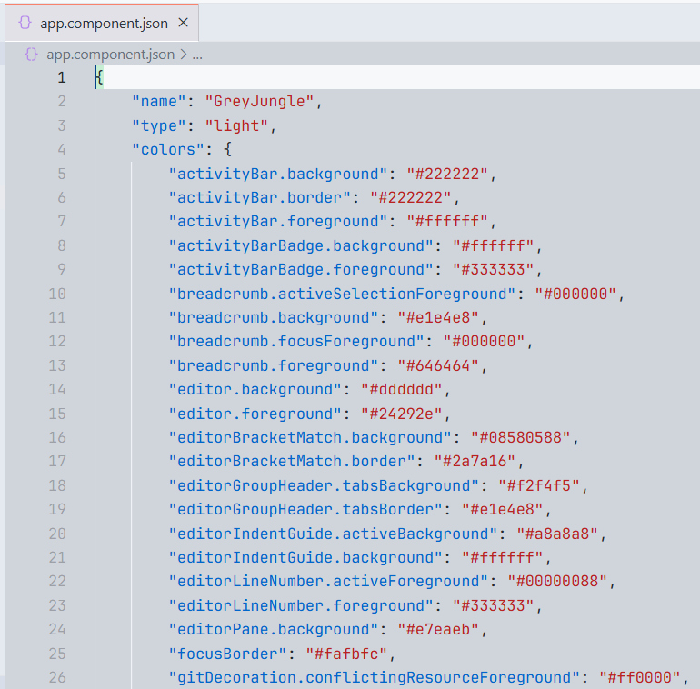
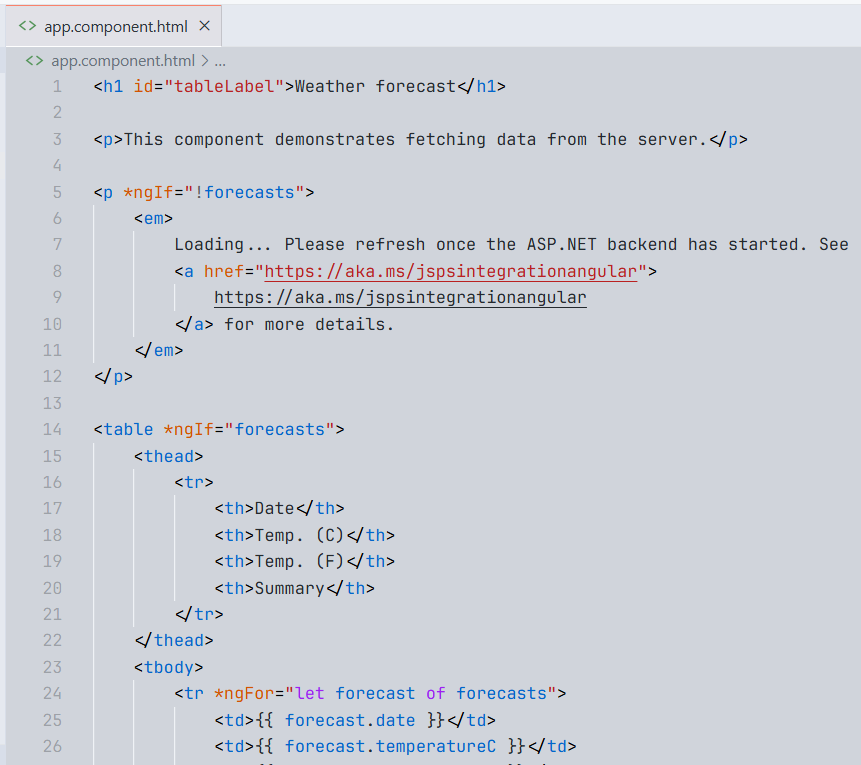

# Gray CLC

# Color Theme for Complex Lighting Conditions

**Gray CLC** is a light color theme for Visual Studio Code designed for **maximum clarity** in **complex lighting environments** (e.g., overexposed monitors, shared workspaces, or sunlight conditions). It combines muted backgrounds with high-contrast syntax colors for excellent readability — especially in languages like **C#**, **JavaScript**, and **JSON**.

*Example: C# syntax highlighting*

---

## ✨ Features

- Balanced gray background for eye comfort.
- High-contrast token coloring.
- Carefully tuned for:
  - **C#**
  - **JSON**
  - **HTML/CSS**
  - **JavaScript / TypeScript**
- Strong support for:
  - Keywords
  - Strings
  - Comments
  - Class names
  - Function calls
  - JSON keys and values

---

## 🔧 Installation

1. Go to the Extensions tab in Visual Studio Code.
2. Search for `Gray CLC`.
3. Click **Install**.
4. Open the Command Palette (`Ctrl+Shift+P` or `Cmd+Shift+P`) and select:  
   `Preferences: Color Theme → Gray CLC`.

---

## 💡 Why “CLC”?

> CLC stands for **Complex Lighting Conditions** — the kind of visual stress we experience in unpredictable or demanding environments. This theme is designed to reduce that stress.

---

## 🖼️ Preview

| Language | Screenshot |
|---------|------------|
| C#      |  |
| JSON    |  |
| HTML    |  |

---

## 📁 Repository

You can find the source code here:  
👉 [github.com/zherar7ordoya/GrayCLC](https://github.com/zherar7ordoya/GrayCLC)

---

## 💬 Feedback

Suggestions, improvements, or issue reports are welcome!  
Just open an issue or start a discussion on the [GitHub repo](https://github.com/zherar7ordoya/GrayCLC/issues).

---

## 🧠 Author

Made with 💙 by **Gerardo Tordoya**  
Analista Programador — UAI  
Contact: [Telegram](https://t.me/GerardoTordoya)

---

## 📜 License

MIT © Gerardo Tordoya

---

## 📌 Changelog

See [CHANGELOG.md](./CHANGELOG.md) for version history.